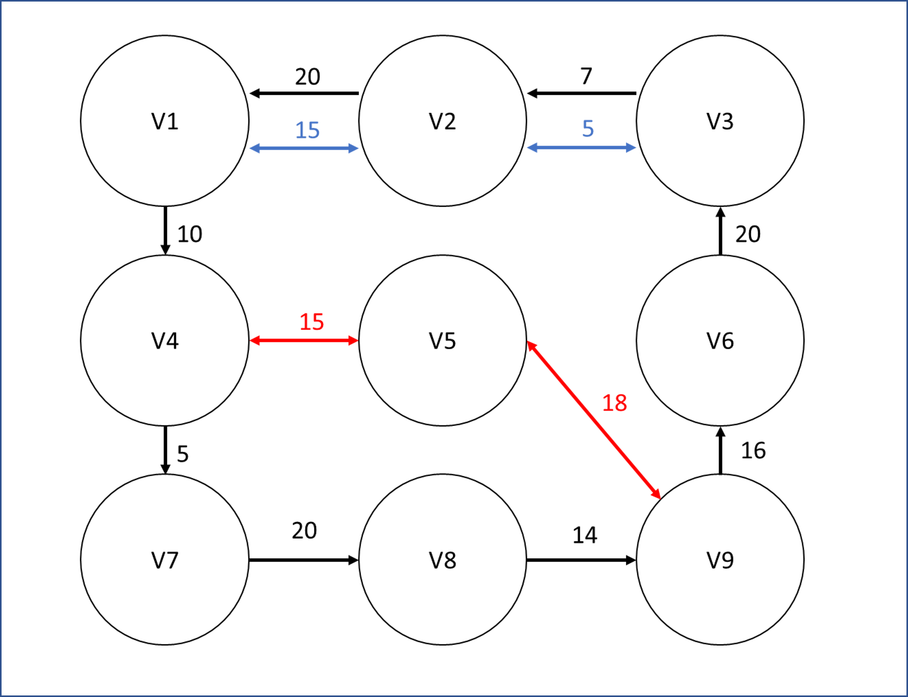
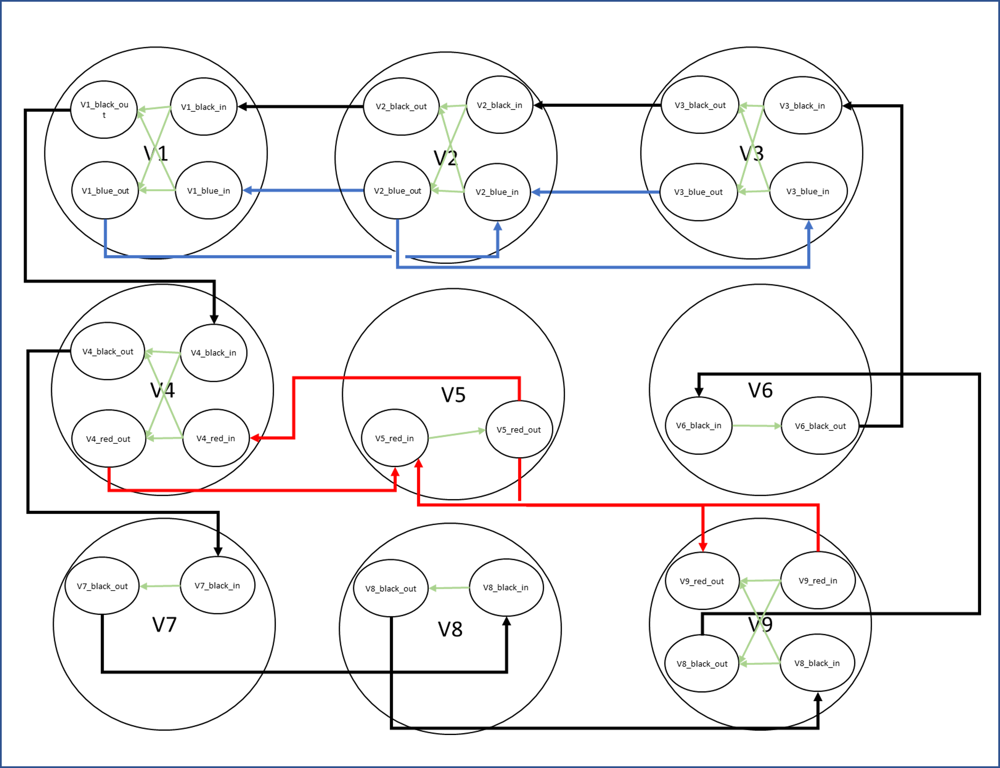

# Method Description

The script expands an input network according to the Kirby and Potts for the calculation of the shortest path via the
Dijkstra method. 

The method reads a .csv file containing information on the network edges. The .csv file contains the
following columns: 

| from_stop_I  | to_stop_I  | d  |  n_vehicles |
|--------------|------------|----|-------------|


Where from_stop_I indicates the starting node, to_stop_I indicates the ending node, d the distance between nodes 
(i.e. the weight of the edge), n_vehicles the vehicle number traveling on that edge.

As an example: 

| from_stop_I  | to_stop_I  | d  |  n_vehicles |
|--------------|------------|----|-------------|
|       1      |     4      | 10 |    black    |
|       1      |     2      | 15 |    blue     |
|       2      |     1      | 20 |    black    |
|       2      |     1      | 15 |    blue     |
|       2      |     3      | 5  |    blue     | 
|       3      |     2      | 7  |    black    |
|       3      |     2      | 5  |    blue     | 
|       4      |     7      | 5  |    black    |
|       4      |     5      | 15 |    red      |
|       5      |     4      | 15 |    red      |
|       5      |     9      | 18 |    red      |
|       6      |     3      | 20 |    black    | 
|       7      |     8      | 20 |    black    | 
|       8      |     9      | 14 |    black    |
|       9      |     5      | 18 |    red      | 
|       9      |     6      | 16 |    black    | 


Represents a network like: 



Any additional columns in the .csv file is ignored in the script. 

The script "expand_network.py" expands the network using the Kirby and Potts expansion, as follows: 



This way, one can assign weights to the internal edges (in light green) to account for transfer delays occuring
e.g. when changing bus. 

The file transfer_delays.csv contains info on the transfer delays. The file contains the following columns: 

| n_vehicles_in  | n_vehicles_in  | d  |  
|----------------|----------------|----|

As an example: 

| n_vehicles_in  | n_vehicles_out | d  |  
|----------------|----------------|----|
|      black     |       blue     | 10 |
|      blue      |       black    | 10 |
|      black     |       red      | 5  |
|      red       |       black    | 5  |
|      blue      |       red      | 8  |
|      red       |       blue     | 8  |

Indicates that transition times to change between black and blue line is 10 (min), transition time between
the black and red line is 5 (min) and transition time between the blue and red line is 8 min.
If no transition time between certain lines combination is given, the script assign transition time = 0.

! IMPORTANT NOTE: A given edge in the input network csv cannot contain multiple n_vehicles. That is, if more
than one line is travelling from one node to the other there have to be multiple edges (rows) in the .csv file as well.
As an example, both black and blue lines travel between node 1 and 2. Therefore, in the .csv files we have 2 lines:

| from_stop_I  | to_stop_I  | d  |  n_vehicles |
|--------------|------------|----|-------------|
|     ...      |    ...     | .. |     ...     |
|       1      |     2      | 15 |    blue     |
|       2      |     1      | 20 |    black    |
|     ...      |    ...     | .. |     ...     |

# Usage

The network edges have to be contained in the data/network.csv file
The transition times between lines have to be contained in the data/transition_time.csv file

An example network.csv and transition_time.csv are contained in the data folder. The script can be launched on the
example as:
```
pip install -r requirements.txt
python expand_network.py
```